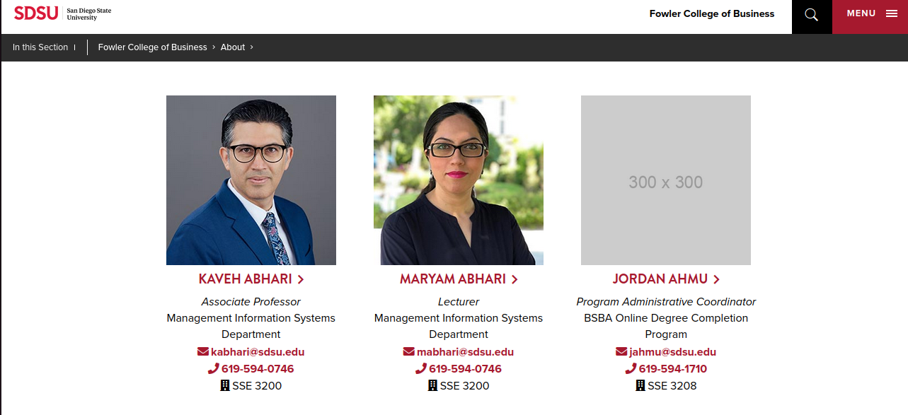
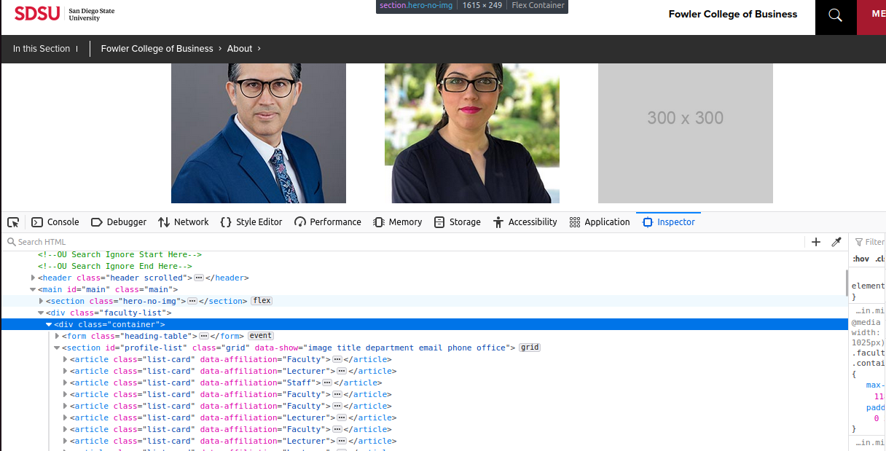

# Web Scraping with Python

# Setup for developement:

- Setup a python 3.x venv (usually in `.venv`)
  - You can run `./scripts/create-venv.sh` to generate one
- `pip3 install --upgrade pip`
- Install pip-tools `pip3 install pip-tools`
- Update dev requirements: `pip-compile --output-file=requirements.dev.txt requirements.dev.in`
- Update requirements: `pip-compile --output-file=requirements.txt requirements.in`
- Install dev requirements `pip3 install -r requirements.dev.txt`
- Install requirements `pip3 install -r requirements.txt`
- `pre-commit install`

## Update versions

`pip-compile --output-file=requirements.dev.txt requirements.dev.in --upgrade`
`pip-compile --output-file=requirements.txt requirements.in --upgrade`

# Run `pre-commit` locally.

`pre-commit run --all-files`

Aim of the project: To scrape email id of all the professors in the MIS department of SDSU.

It's the summer of 2023, and I don't have an internship yet. Now, I am mailing all the professors for work. Cause I neeeddd Moneyy $$$.
I choose the MIS department as they have the most funding of all departments at SDSU.

I wanted to scrape emails but the emails were protected, and I was not able to see em. Have no clue why they did this.
Anyways, I switched focus to scraping all the professors name.

Mis faculty listing website [Link](https://business.sdsu.edu/about/faculty-staff-listing):

MIS faculty website inspect element:

If you look closely, the pattern is quite easy to see. All the professors detail are in a grid. I just need to access the grid first.
But, before that: The website is paginated! And each page had only 4 faculty. So, I had to first find the total no of pages.

After finding total no of pages. The rest of the job was pretty easy. I iterated through each page to find all the professors.
Had to add the current page no tow the end of my html string as https://business.sdsu.edu/about/faculty-staff-listing?page=3

Another tricky part was just taking 'Professors' as the website had staff, lecturer and everyone else. But, only professors were useful in my case, thus I had to filter out everyone else besides 'Professor'

After, successfull extraction I wrote a generic mail across the department! The profs will never know what hit em, Hahahahahahaah (evil luaghter)

